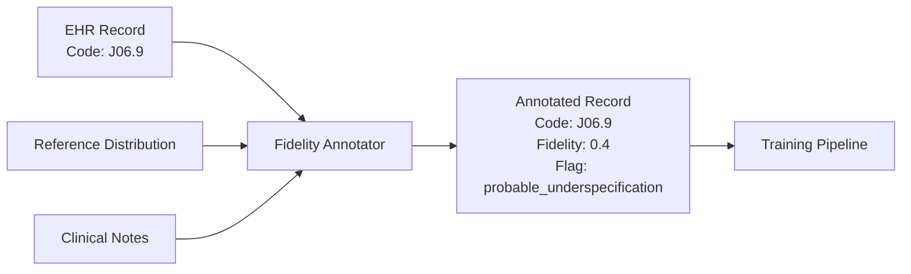

# Pattern 1: Coding-Fidelity Annotation

**Distinguish billing codes from clinical diagnoses at data ingestion.**

Scorecard Question: *"Does your system annotate coding fidelity at data ingestion?"*

---

## Problem

Billing codes are optimized for reimbursement, not clinical accuracy. ICD-10 code J06.9 ("acute upper respiratory infection, unspecified") is frequently assigned when the actual clinical presentation is more specific, because the unspecified code is faster to document and sufficient for billing.

A model trained on these codes does not learn that patients had upper respiratory infections. It learns that clinicians in a particular setting, under particular time pressure, with particular billing incentives, chose to assign J06.9. The code reflects a documentation decision, not a clinical observation.

This becomes dangerous when the model is expected to make clinical predictions. It is predicting coding behavior, not patient outcomes.

## Pattern

At data ingestion, annotate each coded record with a **fidelity score** (0 to 1) that estimates how closely the assigned code reflects the underlying clinical reality.

The fidelity score is computed from:

- **Code specificity**: How specific is the code relative to available alternatives?
- **Note concordance**: Does the clinical note support the assigned code, or suggest a more specific diagnosis?
- **Setting-specific patterns**: Known up-coding or down-coding patterns for the practice type (e.g., primary care vs. emergency department)

## Implementation Sketch

The annotator operates as a preprocessing step before data enters the training pipeline. It does not change the code. It adds metadata that allows downstream models to weight observations by their fidelity.

!!! note "Scope"
    This sketch describes WHAT to build, not the full implementation. The reference distribution models and concordance algorithms are part of the oDIX8 consulting offering.

Key components:

1. **Reference distribution loader**: Expected code distributions by practice setting, specialty, and region
2. **Concordance checker**: NLP-based comparison of clinical note content against assigned code semantics
3. **Fidelity scorer**: Combines specificity, concordance, and distributional signals into a single 0-1 score
4. **Flag generator**: Categorizes low-fidelity records (underspecification, incentive-driven coding, documentation artifact)

## Risk if Missing

Without coding-fidelity annotation, every coded record is treated as equally reliable. The model cannot distinguish between a carefully documented diagnosis and a hastily assigned billing code. Systematic coding biases propagate directly into model weights.

The result: predictions that correlate with billing incentives rather than patient outcomes.

## Related Research

- Prequel 1: "Symptom and Billing Code Are Not the Same Thing" (SSRN, 2026)
- EMoT Quality Framework: [arXiv:2603.24065](https://arxiv.org/abs/2603.24065)
