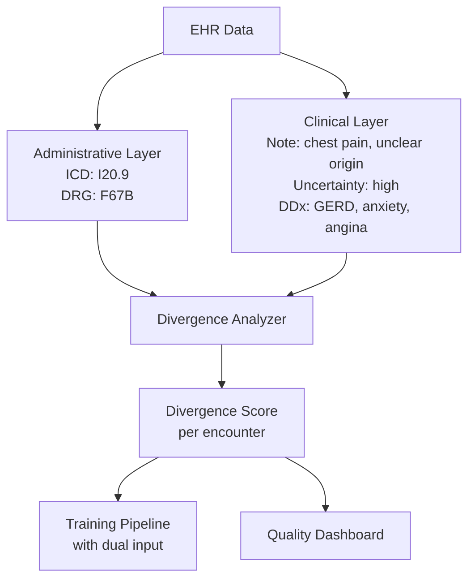

# Pattern 4: Dual Representation

**Maintain parallel clinical and administrative data layers.**

Scorecard Question: *"Do you maintain parallel clinical and administrative representations?"*

---

## Problem

Most clinical AI systems work with a single data representation that collapses clinical observations and administrative codes into one layer. "Chest pain, unclear origin" becomes I20.9 ("Angina pectoris, unspecified") becomes a binary feature in a risk model.

The clinical reality and the billing code describe different things. The clinical observation carries uncertainty, context, and nuance. The billing code carries reimbursement optimization and documentation constraints. Collapsing them into one representation destroys information that is critical for valid clinical predictions.

## Pattern

Maintain two parallel data layers: an **administrative layer** (codes, billing data, structured documentation) and a **clinical layer** (notes, observations, uncertainty markers, clinical reasoning). Measure the divergence between layers as a continuous data quality signal.

High divergence between layers is not an error to be fixed. It is a signal that indicates where administrative convenience has overridden clinical precision.

## Implementation Sketch

!!! note "Scope"
    This sketch describes WHAT to build. The divergence metrics and dual-layer architectures are part of the oDIX8 consulting offering.

Key components:

1. **Layer splitter**: Separates incoming EHR data into administrative and clinical components
2. **Clinical NLP extractor**: Extracts structured observations, uncertainty markers, and differential diagnoses from clinical notes
3. **Divergence scorer**: Computes per-encounter divergence between what was coded and what was documented
4. **Dual-input adapter**: Provides both layers to downstream models, allowing them to learn from clinical reality rather than administrative shortcuts

## Risk if Missing

The model conflates billing optimization with clinical decision-making. It cannot distinguish between a diagnosis made for clinical reasons and a code assigned for reimbursement reasons. Both look identical in the training data.

## Related Research

- MMDS Ontological Analysis (npj Digital Medicine, submitted)
- Prequel 1: "Symptom and Billing Code Are Not the Same Thing"
