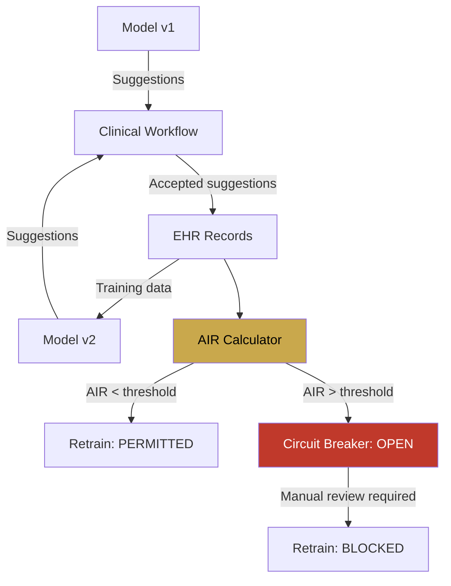

# Pattern 5: Feedback Loop Monitoring

**Track the AI influence ratio to break reification loops.**

Scorecard Question: *"Do you track the AI influence ratio in your training data?"*

---

## Problem

This is the most dangerous pattern in clinical AI, and the hardest to detect.

When an AI system suggests codes or diagnoses, clinicians may accept those suggestions. The accepted suggestions are recorded in the EHR. Those EHR records become training data for the next model iteration. The model is now learning from its own previous outputs.

This creates a **reification loop**: the model's biases are encoded into clinical records, which reinforce those biases in the next training cycle. The system appears to be improving (agreement between model and clinicians increases), but it is actually deepening its own distortions.

## Pattern

Track the **AI Influence Ratio (AIR)**: the percentage of training data that was generated or influenced by previous model outputs. Implement a **circuit breaker** that pauses retraining when AIR exceeds a defined threshold.

The circuit breaker has three states:

- **CLOSED**: AIR is below threshold. Retraining proceeds normally.
- **OPEN**: AIR exceeds threshold. Retraining is blocked until manual review confirms data independence.
- **HALF-OPEN**: After review, a limited retraining cycle is permitted with enhanced monitoring.

## Implementation Sketch

!!! note "Scope"
    This sketch describes WHAT to build. AIR threshold calibration and reification detection algorithms are part of the oDIX8 consulting offering.

Key components:

1. **Provenance tracker**: Tags every data point with its origin (human-only, AI-suggested-accepted, AI-suggested-modified, AI-suggested-rejected)
2. **AIR calculator**: Computes the AI influence ratio per cohort, per time window, and per clinical domain
3. **Circuit breaker**: Automated gate that blocks retraining pipelines when AIR exceeds configurable thresholds
4. **Reification detector**: Identifies self-reinforcing patterns where model confidence and training data agreement both increase without external validation

## Risk if Missing

Autonomous model drift disguised as improvement. Every standard metric improves (model and data agree more over time), while the system progressively disconnects from clinical reality. By the time the problem is detected, the feedback loop may have contaminated years of training data.

## Related Research

- Capstone: "Governing the Loop" (npj Digital Medicine, planned)
- Prequel 2: "Artificial Epidemiology"
- EMoT Reification Analysis: [arXiv:2603.24065](https://arxiv.org/abs/2603.24065)
