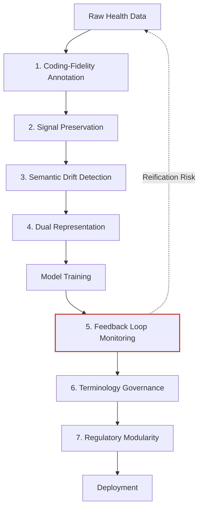

# The 7 Patterns

These seven design patterns were identified through systematic analysis of how clinical AI systems fail when deployed in real healthcare environments. They are derived from 12 peer-reviewed publications spanning 22 disciplines.

Each pattern addresses a specific layer of the data-to-deployment pipeline where ontological distortion enters, propagates, or amplifies.

## Architecture Overview

## Pattern Summary

| # | Pattern | One-Liner | Risk if Missing | Complexity |
|---|---------|-----------|-----------------|------------|
| 1 | [Coding-Fidelity Annotation](coding-fidelity.md) | Distinguish billing codes from clinical diagnoses at ingestion | Model learns billing behavior, not clinical reality | Low |
| 2 | [Signal Preservation](signal-preservation.md) | Preserve rare clinical signals instead of pruning them | System becomes a common-case predictor with no clinical edge | Medium |
| 3 | [Semantic Drift Detection](semantic-drift.md) | Detect meaning shifts, not just distribution shifts | Silent model degradation that passes all standard checks | Medium |
| 4 | [Dual Representation](dual-representation.md) | Maintain parallel clinical and administrative data layers | Conflation of billing optimization with clinical decisions | High |
| 5 | [Feedback Loop Monitoring](feedback-loop.md) | Track AI influence ratio to break reification loops | Autonomous model drift disguised as improvement | High |
| 6 | [Terminology Governance](terminology-governance.md) | Treat vocabulary updates as schema migrations | Cross-version contamination in training data | Medium |
| 7 | [Regulatory Modularity](regulatory-modularity.md) | Build pluggable compliance adapters | Compliance debt after regulatory updates | Medium |

## Reading Order

For teams new to ontological fidelity, we recommend starting with **Pattern 1** (Coding-Fidelity Annotation) as it addresses the most fundamental layer: data ingestion. Pattern 5 (Feedback Loop Monitoring) is the most architecturally complex and the most dangerous if missing.
