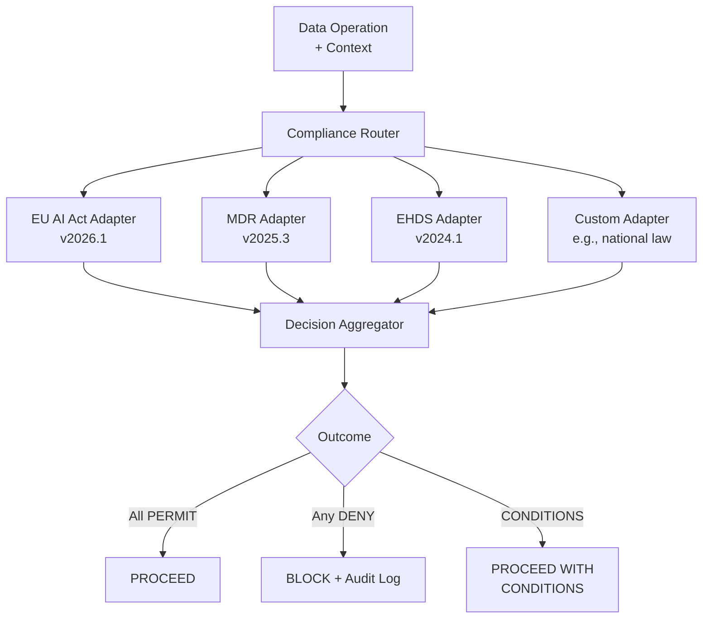

# Pattern 7: Regulatory Modularity

**Build pluggable compliance adapters, not hard-coded regulatory logic.**

Scorecard Question: *"Do you have a pluggable EU AI Act / MDR compliance layer?"*

---

## Problem

The EU AI Act, MDR (Medical Device Regulation), and EHDS (European Health Data Space) are evolving simultaneously. Teams that hard-code compliance checks into their pipelines face a compounding problem: every regulatory update requires re-engineering, re-testing, and re-deploying the entire system.

Regulations change faster than most teams can adapt. Hard-coded compliance becomes compliance debt: the system silently falls out of compliance after an update that nobody tracked.

## Pattern

Build a **pluggable compliance adapter layer** where each jurisdiction and regulation is a composable module. Each adapter evaluates data operations against its ruleset and returns a structured decision.

Each adapter returns one of three decisions:

- **PERMIT**: Operation is compliant under this regulation
- **DENY**: Operation violates this regulation (with specific article reference)
- **PERMIT-WITH-CONDITIONS**: Operation is compliant if specific conditions are met (e.g., anonymization, consent verification)

## Implementation Sketch

!!! note "Scope"
    This sketch describes WHAT to build. Jurisdiction-specific adapter rulesets and compliance mapping are part of the oDIX8 consulting offering.

Key components:

1. **Compliance router**: Routes each data operation to all applicable adapters based on jurisdiction, data type, and use case
2. **Adapter interface**: Standardized input/output contract that all regulatory modules implement
3. **Decision aggregator**: Combines adapter decisions using a conservative (most restrictive) merge strategy
4. **Audit trail**: Immutable log of every compliance decision with adapter version, ruleset version, and decision rationale
5. **Version manager**: Tracks which regulatory version each adapter implements; alerts when updates are available

## Risk if Missing

Compliance debt. The system becomes non-compliant silently after regulatory updates. By the time an audit occurs, the gap between actual system behavior and current regulatory requirements may be substantial.

## Related Research

- PRAXIS-AI Framework (SSRN/medRxiv, submitted)
- Capstone: "Governing the Loop" (npj Digital Medicine, planned)
