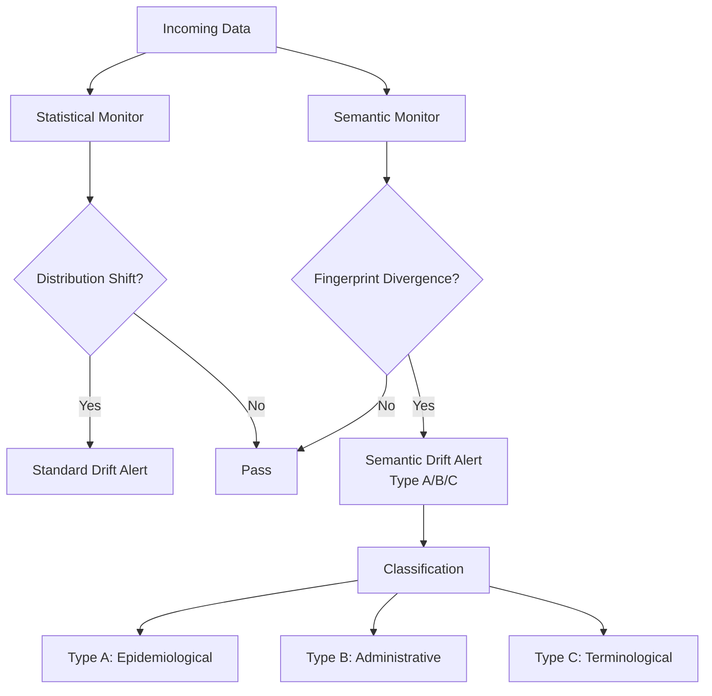

# Pattern 3: Semantic Drift Detection

**Detect meaning shifts, not just distribution shifts.**

Scorecard Question: *"Do you monitor semantic drift, not just statistical drift?"*

---

## Problem

Statistical drift detection monitors whether the distribution of incoming data has changed relative to training data. This catches many real-world problems, but it misses a critical category: semantic drift.

Semantic drift occurs when the meaning of a code or term changes while its statistical distribution remains stable. For example, when ICD-10 billing guidelines change how a code should be applied, the frequency may stay similar but the clinical population it represents shifts entirely. Standard drift detectors see no anomaly. The model degrades silently.

## Pattern

Maintain a **Semantic Fingerprint** per code or term that captures not just frequency, but usage context, co-occurrence patterns, and documentation concordance. Alert on fingerprint divergence even when statistical distribution is stable.

Drift is classified into three types:

- **Type A (Epidemiological)**: Genuine change in disease patterns
- **Type B (Administrative)**: Change in coding guidelines or billing incentives
- **Type C (Terminological)**: Vocabulary update that redefines code semantics

Only Type A represents real clinical change. Types B and C are artifacts that must be filtered before model retraining.

## Implementation Sketch

!!! note "Scope"
    This sketch describes WHAT to build. The fingerprint construction method and drift classification algorithms are part of the oDIX8 consulting offering.

Key components:

1. **Fingerprint builder**: Constructs a semantic fingerprint per code from co-occurrence vectors, note context, and temporal patterns
2. **Divergence detector**: Compares current fingerprint against baseline, independent of statistical drift
3. **Drift classifier**: Categorizes detected drift as Type A, B, or C
4. **Alert router**: Different response protocols per drift type (Type A: retrain, Type B: adjust pipeline, Type C: migrate terminology)

## Risk if Missing

Silent model degradation that passes all standard monitoring checks. The model appears healthy by every metric while its predictions become increasingly disconnected from clinical reality.

## Related Research

- Prequel 2: "Artificial Epidemiology" (arXiv cs.CY, in preparation)
- Terminology Governance Series: "The Shrinking Window"
