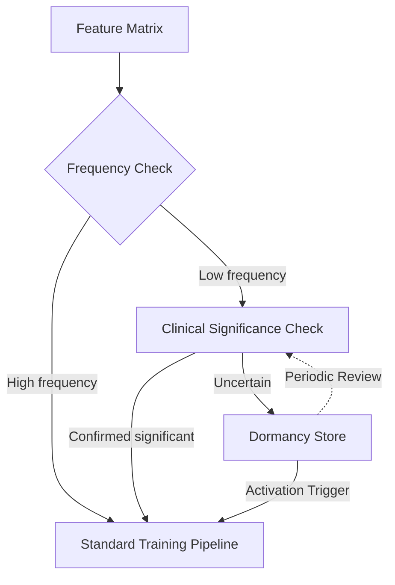

# Pattern 2: Signal Preservation

**Preserve rare but critical clinical signals instead of pruning them.**

Scorecard Question: *"Do you preserve low-frequency clinical signals in your training data?"*

---

## Problem

Standard ML pipelines apply frequency-based feature selection. Features that appear rarely are pruned as noise. In clinical data, this is exactly backwards. Rare signals, such as early-stage presentations, atypical drug reactions, or uncommon genetic variants, are often the cases where AI could add the most value.

A primary care physician sees 30 upper respiratory infections for every early-stage lung malignancy. If the model is optimized for common cases, it becomes a sophisticated confirmation tool for what the clinician already knows. It adds no value for the cases where clinical decision support is most needed.

## Pattern

Instead of pruning low-frequency features, route them to a **Dormancy Store**. These features remain available for targeted analysis and can be reactivated when new evidence confirms their clinical significance.

The dormancy store is not an archive. It is an active monitoring component that periodically re-evaluates stored signals against new clinical evidence.

## Implementation Sketch

!!! note "Scope"
    This sketch describes WHAT to build. Significance thresholds and activation criteria are domain-specific and part of the oDIX8 consulting offering.

Key components:

1. **Frequency classifier**: Separates features into high-frequency (standard pipeline) and low-frequency (significance check) tracks
2. **Clinical significance scorer**: Evaluates rare features against known clinical importance (literature-backed, not purely statistical)
3. **Dormancy store**: Persistent, versioned storage for low-frequency features with full provenance
4. **Activation trigger**: Rule-based or evidence-triggered mechanism to promote dormant features back into the training pipeline

## Risk if Missing

The model becomes a "common case predictor" that adds no clinical value beyond physician intuition. It performs well on benchmarks (which are dominated by common cases) but fails on the rare, high-stakes decisions where AI support is most needed.

## Related Research

- EMoT Strategic Dormancy Architecture: [arXiv:2603.24065](https://arxiv.org/abs/2603.24065)
- Prequel 3: "Preserve, Don't Prune" (arXiv cs.AI, concept stage)
