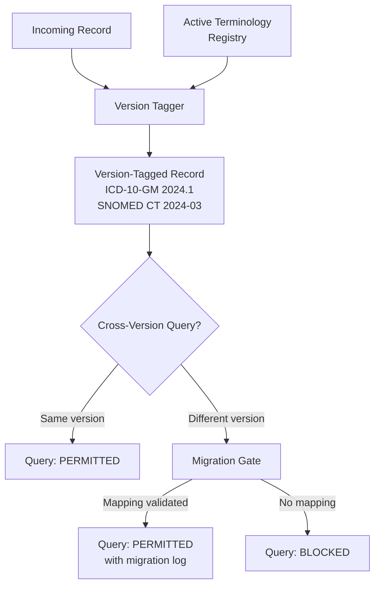

# Pattern 6: Terminology Governance

**Treat vocabulary updates as schema migrations.**

Scorecard Question: *"Do you treat terminology updates as schema migrations?"*

---

## Problem

ICD-10, SNOMED CT, and LOINC are updated annually. Each update can add, remove, redefine, or reclassify codes. Most clinical AI systems silently ingest data across terminology versions without tracking which version was active when each record was created.

A model trained on data spanning ICD-10 2020 through 2025 is training on five different vocabularies simultaneously, without awareness that the same code may have meant different things in different years. This is the equivalent of training a multilingual model without language tags.

## Pattern

Treat every terminology update as a **schema migration**. Version-tag every record at ingestion. Block cross-version queries unless explicitly migrated through a validated mapping.

## Implementation Sketch

!!! note "Scope"
    This sketch describes WHAT to build. Cross-version mapping validation and migration strategies are part of the oDIX8 consulting offering.

Key components:

1. **Terminology registry**: Maintains active versions of all coding systems with effective dates
2. **Version tagger**: Stamps every record at ingestion with the terminology version(s) active at time of documentation
3. **Migration gate**: Validates cross-version queries against approved mappings before allowing mixed-version analysis
4. **Migration log**: Full audit trail of which mappings were applied, when, and by whom

## Risk if Missing

Cross-version contamination. Training data from different terminology epochs is mixed without awareness. The model learns patterns that are artifacts of vocabulary changes rather than clinical reality.

## Related Research

- Terminology Governance Series: "Mapping the Semantic Landscape" (IJMI/BMC MIDM, data stage)
- Terminology Governance Series: "How HL7 Won" (JAMIA, pre-draft)
- Capstone: "Terminology Confusion as Structural Barrier" (IJMI v1.4)
